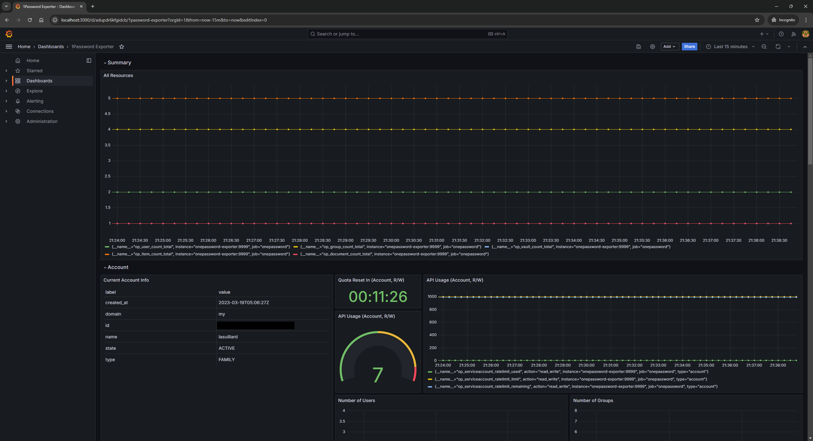

# Grafana Dashboard Example

This example shows example setup using Docker Compose with preconfigured Grafana dashboard for 1Password Exporter.

## Usage

Create `.env` file with appropriate values (see `.env.example` for required values):

```dotenv
OP_SERVICE_ACCOUNT_TOKEN='ops_...'
```

Start Docker Compose:

```bash
$ docker compose up -d
```

Then open Grafana running at http://localhost:3000 (default admin username and password are both `"admin"`) then go to Dashboards and you will find 1Password Exporter dashboard.


